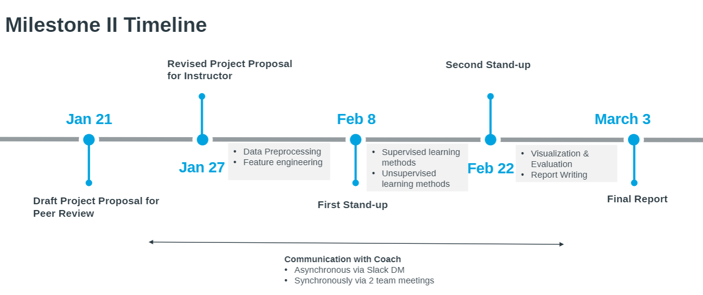
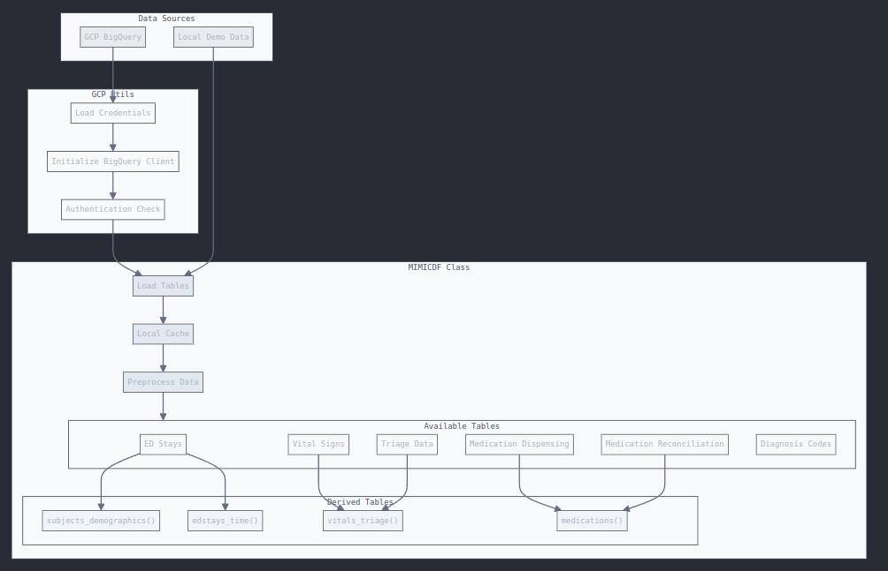

# Milestone II Timeline



## January

- **Jan 7**: Course begins; Coursera content opens
- **Jan 13**: Teams formed and topics selected (via Google Sheets)
- **Jan 14**: Project coaches assigned
- **Jan 17**:
  - Dataset reviews with faculty coach in group DMs
  - Comprehensive Quiz (Parts A, B, C) opens
- **Jan 21**: Draft project proposal submitted for peer review
- **Jan 25**: Peer feedback on proposals completed
- **Jan 27**: Submit revised project proposal for instructor review

## February

- **Feb 8**: First stand-up video report submission (via Slack)
- **Feb 10**: Feedback to other teams' stand-ups due
- **Feb 22**: Second stand-up video report submission (via Slack)
- **Feb 24**: Feedback to other teams' second stand-ups due

## March

- **Mar 3**: Final project report submission due (via Coursera and Google Docs link)


# MIMIC-IV ED Data Preprocessing Pipeline

This project provides a robust data preprocessing pipeline for the MIMIC-IV Emergency Department dataset, offering both local demo data processing and full dataset access through Google Cloud Platform's BigQuery.

## Overview

The pipeline consists of two main components:
- `gcp_utils.py`: Handles GCP authentication and BigQuery client setup
- `mimicdf.py`: Manages data loading, preprocessing, and caching through the MIMICDF class

## Prerequisites

- Python 3.8+
- Google Cloud Platform account (for full dataset access)
- PhysioNet credentialing (for MIMIC-IV ED dataset access)
- Required Python packages (install via `pip install -r requirements.txt`):
  - google-cloud-bigquery
  - pandas
  - python-dotenv
  - typing

## Setup

1. Clone the repository
```bash
git clone <repository-url>
cd <repository-name>
```

2. Install dependencies
```bash
pip install -r requirements.txt
```

3. Configure environment variables
Create a `.env` file in the project root:
```env
GCP_PROJECT_ID=your-project-id
```

4. Prepare authentication (for GCP access)
```bash
gcloud auth application-default login
```

## Usage

### Basic Usage

```python
from mimicdf import MIMICDF

# For demo data
mimic = MIMICDF(source='demo')

# For full dataset via GCP
mimic = MIMICDF(source='gcp')
```

### Available Tables

The MIMICDF class provides access to the following base tables:
- `edstays()`: ED stays with demographics
- `vitals()`: Vital signs measurements
- `triage()`: Triage assessments
- `pyxis()`: Medication dispensing records
- `medrecon()`: Medication reconciliation records
- `diagnosis()`: Diagnosis codes and descriptions

### Derived Tables

The class also offers preprocessed, derived tables:
- `subjects_demographics()`: Consolidated patient demographics
- `edstays_time()`: Time-based analysis of ED stays
- `vitals_triage()`: Combined vital signs from regular measurements and triage
- `medications()`: Unified medication records from pyxis and medrecon

### Cache Management

Data is automatically cached for better performance:
```python
# Clear cache when needed
mimic.clear_cache()
```

## Data Processing Details

### GCP Authentication (`gcp_utils.py`)

The `BigQueryClient` class handles:
- Authentication with GCP
- Access verification for MIMIC dataset
- Query execution and error handling

### Data Loading (`mimicdf.py`)

The `MIMICDF` class provides:
- Automatic switching between demo and full dataset
- Data preprocessing and type conversion
- Caching mechanism for better performance
- Standardized access to all MIMIC-IV ED tables

## Error Handling

Common errors and solutions:

1. BigQuery Access Error
```python
BigQueryAccessError: Access Denied. Please ensure:
1. You have completed the PhysioNet credentialing process
2. You have been granted access to MIMIC-IV ED dataset
3. You are using the same Google account that has BigQuery access
```

2. Demo Data Not Found
```python
FileNotFoundError: Demo file not found: {file_path}. 
Please check if the demo files are present.
```
## Data Preprocessing Pipeline

